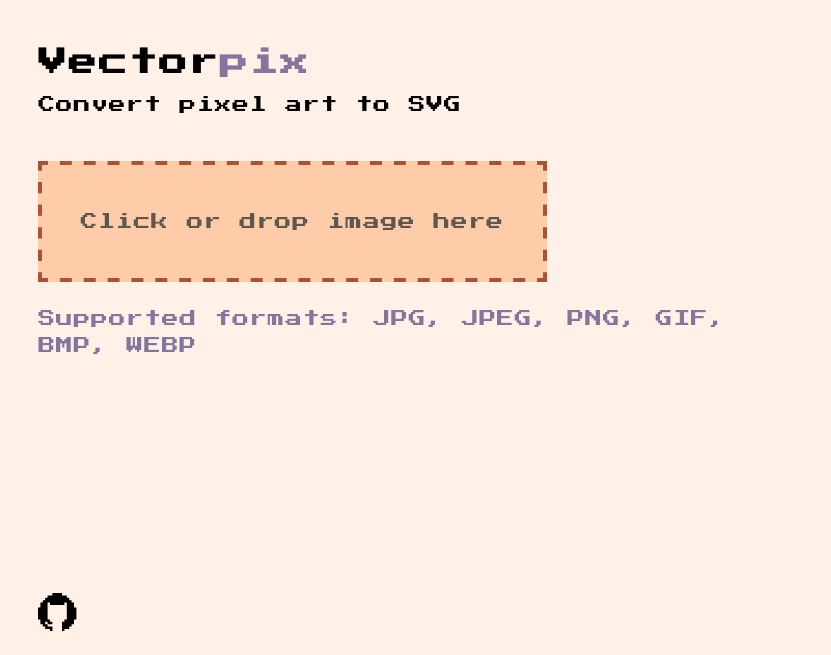

# Vectorpix

A lightweight web application that converts pixel-art images (JPG, PNG, GIF, BMP, WEBP) into SVG format.
Check it out [here](https://402e.github.io/vectorpix)

> ⚠️ Currently, large images are not supported. The converter is optimized for small, pixel-art images.

